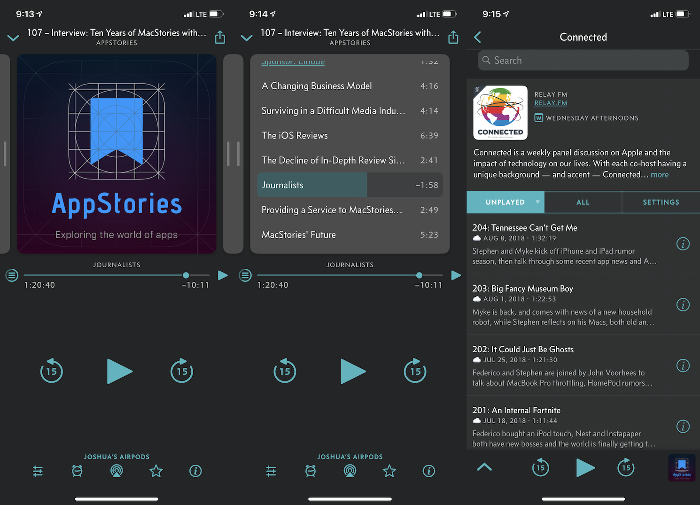

+++
title = "Switching to Overcast"
date = 2019-04-17T00:00:00-04:00
author = "Joshua Grady"
cover = ""
tags = ["Podcasts", "Overcast", "Pocket Casts"]
description = "Podcasts are kind of a big deal nowadays. I’ve been an off-and-on podcast listener for a few years, but over the last few months, I’ve really started to dive into more and more shows. Thanks to podcast networks like [Relay FM](https://www.relay.fm) and long-running shows like [Binge Mode](https://www.theringer.com/binge-mode), I regularly listen to multiple podcasts on a variety of topics every day."
+++

Podcasts are kind of a big deal nowadays. I’ve been an off-and-on podcast listener for a few years, but over the last few months, I’ve really started to dive into more and more shows. Thanks to podcast networks like [Relay FM](https://www.relay.fm) and long-running shows like [Binge Mode](https://www.theringer.com/binge-mode), I regularly listen to multiple podcasts on a variety of topics every day.

Though built-in apps such as Apple’s Podcasts app are completely functional, they often lack certain features that I appreciate when listening to podcasts related to things such as support for smart speed adjustments, clip sharing, and cross-platform progress syncing. For several years now, I’ve used [Pocket Casts](https://www.pocketcasts.com) as my primary app for listening to podcasts across the many devices that I've used. Pocket Casts has followed me from Android to iOS (and briefly back to Android then ultimately back to iOS again), along with occasional playback with their web player and desktop apps.

Their system of episode and playback syncing worked usually _well enough_ for me, though not without issues. Switching devices was always iffy in regards to syncing my overall progress within individual shows, especially those with a long list of unplayed episodes. Considering there weren’t a ton of great alternatives that worked across both Android and iOS, Pocket Casts always seemed like the clear choice.

Now that I’ve fully returned to using Apple devices for the foreseeable future, I started to hear more and more about an app called [Overcast](https://overcast.fm). There was nothing but praise for this app from many of the hosts over at Relay FM, and considering the overall instability with Pocket Casts since its [Version 7 update](https://blog.pocketcasts.com/pocket-casts-7/), I decided to give it a shot.

Not to my surprise, Overcast is an incredible app, and nearly every issue I was experiencing with Pocket Casts was resolved when switching over. Though design is an incredibly subjective topic, I love the way Overcasts looks and functions. Using a card-based design to switch from artwork to show notes, chapters, and even playback settings is wonderful to use. Unfortunately, I'm not a huge fan of the color orange, so dark mode with a clean ocean-like shade of blue looks incredible. And there's even a custom icon to match.

---

_Two of my current favorite podcasts: [AppStories](https://appstories.net) and [Connected](https://www.relay.fm/connected)_

---

Listening to episodes is also a pleasure thanks to a mix of manual playback speed options and a “smart speed” feature that assists with removing moments of silence. Of course, you can also configure custom playback options for each podcast in your library if preferred. Pocket Casts offers similar functionality in regards to removing silence, but Overcast’s implementation of this feature is noticeably better in the podcasts that I usually listen to.

I’ve also had great luck with syncing progress across both my iPhone and iPad, which was extremely hit-or-miss in the recent updates for Pocket Casts. Considering that I often switch from one device to another randomly throughout any given day, having this feature work reliably is something I thoroughly appreciate. Proper Siri Shortcuts support has also been wonderful, as this functionality rarely worked as expected with Pocket Casts. Since spring is finally rolling around, I’ve been taking lots of walks with my dog, so asking Siri to play episode of any podcast or to skip a specific chapter in an episode is convenient when I’m not always able to grab my phone.

Though I’m thoroughly enjoying Overcast, there are still some features from Pocket Casts that I’ve been missing. For example, Pocket Casts recently implemented the ability to archive episodes. This is a separate process from marking an episode as played, and it allowed for episodes to be removed from the episode list without appearing to have been listened to. This kept my listening history a lot cleaner by preventing episodes that I never played from showing up. Speaking of listening history, Overcast also doesn’t seem to currently offer a way to view a total list of all episodes you’ve ever listened to, and this was useful from time to time in Pocket Casts.

There’s also a ton of work that could be done to the web experience with Overcast. While I listen to most podcasts on my iPhone, I do spend a lot of time at my desk for my job. Thus, while I can continue playback using Overcast’s web client, playback at 1.5x speed sounds odd and tinny. There’s also no simple way to locate the episode of the podcast you were last listening to without locating it manually inside said podcast. And although Pocket Casts macOS app was essentially their web player [wrapped in Electron](https://www.theverge.com/circuitbreaker/2018/5/16/17361696/chrome-os-electron-desktop-applications-apple-microsoft-google) with media key functionality, I would absolutely pay for a native Overcast app for macOS. Perhaps this could happen later this year thanks to [Marzipan](https://www.imore.com/marzipan).

I’ve only been using Overcast for around a week now, and while there’s definitely a few features I miss from Pocket Casts, I’m definitely not going back. Overcast provides solid functionality for playback mixed with a clean design, and I’ve already settled in with a premium subscription. Here’s to many, many more podcasts.
